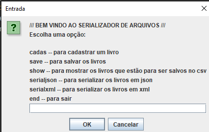
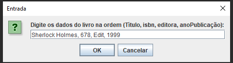

1. Defina uma entidade principal relacionada a um domínio de problema e crie uma classe Java para representá-la. Exemplo: Livro: isbn, titulo, editora, ano_publicacao.

2. Crie uma classe Java para cadastrar dados relacionados à entidade definida na questão 1. A classe deve receber dados via teclado e os salvar ao final de um arquivo CSV (append).

3. Crie uma classe Java que recebe como entrada o arquivo salvo na questão 2, lê o arquivo e o transforma em objetos Java em memória. Depois, salva os objetos em formatos XML e JSON.

