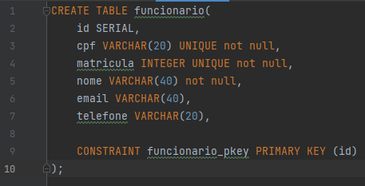
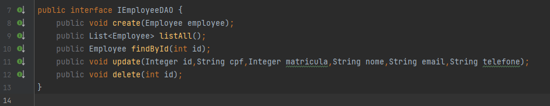
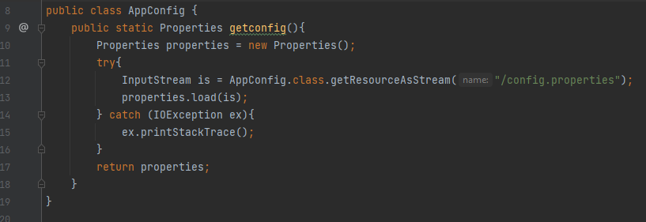
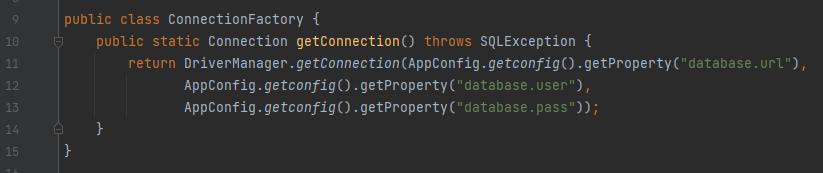
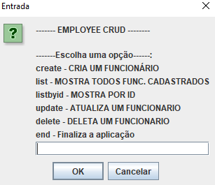
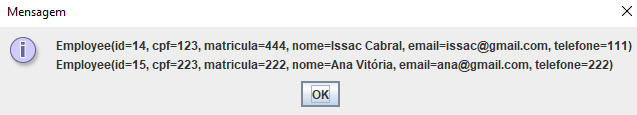
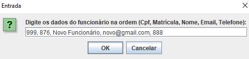
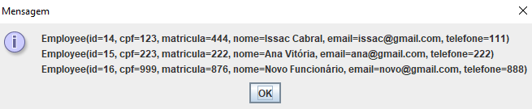

Tema: Desenvolvimento para Persistência usando Bancos Relacionais com Java JDBC

<h1>Descrição da Atividade</h1>

1. Crie uma aplicação que use um banco relacional contendo uma tabela de funcionários, com suas respectivas classes Java.
Cada funcionário deve ter um id, cpf, matrícula, nome, email e telefone.

2. Os campos id, cpf e matrícula devem não devem permitir duplicação, ou seja devem ser únicos.

3. Crie uma implementação de DAO usando JDBC que representa uma interface única para persistência dos dados.

4. Crie e use no DAO somente os métodos realmente necessários para a resolução desta lista. Crie-os sob demanda.

5. Crie métodos no DAO para inserir, deletar, alterar e consultar funcionários.

6. A aplicação deve ter um menu para realizar as funcionalidades previstas nas questões anteriores (consultas e atualizações).

<h2>Como Fiz:</h2>

1. Criei uma simples tabela e tornei os elementos id, cpf e matrícula únicos:

2. Fiz uma interface EmployeeDAO para que seja implementada por qualquer tipo de usuário que vá fazer uma persistência dos dados: seja uma list, postgresql, JDBC, ou qualquer outro banco. Possui os métodos básicos para um CRUD como pode ver abaixo:

3. Criei uma classe AppConfig para que possa buscar as informações do banco a partir de um arquivo.properties e retornar esse properties de maneira estática para haver um desacoplamento e não deixar essa responsabilidade para a ConnectionFactory:

<h3>Acessando e retornando o arquivo:</h3>

<h3>Retornando a conexão:</h3>

4. Fiz um Menu para o usuário usando o JOptionPane:

<h3>Listando os funcionários: </h3>

<h3>Criando um funcionário: </h3>

<h3>Veja que realmente o funcionário foi salvo</h3>

As demais funcionalidades e métodos estão funcionando também.
Para mais detalhes da aplicação, fique à vontade para acessar as pastas :) Ou ainda, melhore este App e use nos seus projetos!
